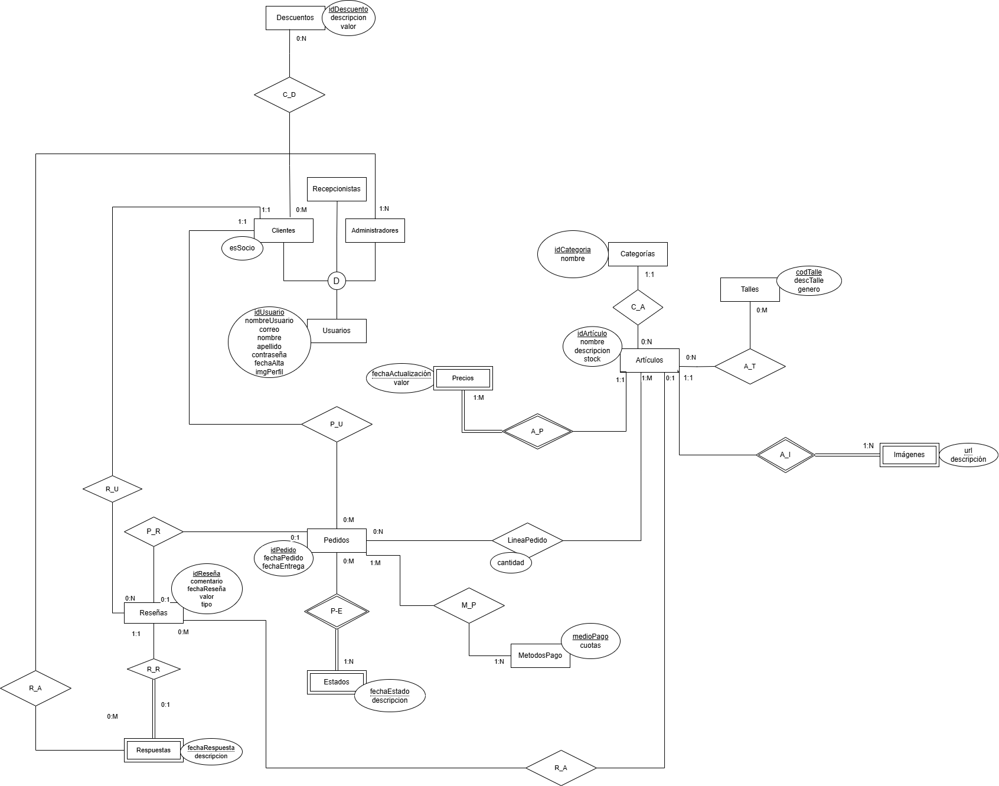

# Propuesta TP DSW

## Grupo
### Integrantes
* 53276 - Tarrio Gennero, Nicolás
* 53600 - Re, Joaquin Eduardo
* 52301 - Maseda, Valentino
* 52059 - Sarmiento, Alfonso
* 52657- Fe, Catalina

### Repositorios
* [fullstack app]()

## Tema
### Descripción
La tienda online oficial del club social y deportivo ofrece merchandising exclusivo a través de una plataforma donde los usuarios pueden registrarse, crear perfiles y disfrutar de un sistema de roles que distingue entre clientes regulares, socios, administradores y recepcionistas. El catálogo organiza los productos en categorías definidas, con detalles completos sobre cada artículo, mientras que el proceso de compra incluye un carrito y diversas opciones de pago seguras. La gestión de pedidos mantiene un historial de compras accesible para cada usuario. Los clientes pueden publicar reseñas y calificaciones sobre artículos y pedidos para orientar a otros compradores, y acceder a promociones especiales en fechas significativas para el club. La plataforma también incorpora herramientas analíticas para optimizar inventario, ventas y experiencia del usuario, funcionando no solo como canal comercial sino como extensión digital de los productos del club. 

### Modelo

## Alcance Funcional 

### Alcance Mínimo

Regularidad:
|Req|Detalle|
|:-|:-|
|CRUD simple|1. CRUD Usuario 2. CRUD Artículos 3. CRUD Categoría 4. CRUD Descuentos 5. CRUD Pedidos |
|CRUD dependiente|1. CRUD Precio {depende de} CRUD Artículos 2. CRUD Comentario {depende de} CRUD Artículos 3.CRUD Reseña Pedido {depende de} CRUD Pedido |
|Listado + detalle| 1. Listado de artículos filtrados por categoría, ordenados de menor a mayor antigüedad, muestra detalle de nombre, descripción, precio e imagen => detalle muestra datos parciales del artículo, imágenes y precio.  2. Listado de pedidos filtrados por estado ‘a retirar’, muestra el idPedido, nombre y apellido del cliente => detalle CRUD pedidos y nombre y apellido del cliente.|
|CUU/Epic|1. Realizar pedido 2. Cargar artículo 3. Crear usuario 4. Modificar usuario|

Adicionales para Aprobación
|Req|Detalle|
|:-|:-|
|CRUD |1. CRUD Usuario 2. CRUD Artículos 3. CRUD Categoría 4. CRUD Descuentos 5. CRUD Pedidos 6. CRUD método de pago 7. CRUD Precio {depende de} CRUD Artículos 8. CRUD Comentario {depende de} CRUD Artículos 9. CRUD Reseña Pedido {depende de} CRUD Pedidos 10. Estados de pedidos {depende de} CRUD Pedidos 11. CRUD Imágenes {depende de} CRUD artículos|
|CUU/Epic|1. Generar comentario sobre artículo 2. Responder comentario sobre artículo 3. Gestionar pedidos|

### Alcance Adicional Voluntario

|Req|Detalle|
|:-|:-|
|Listados |1. Listado de reseña de pedidos filtrado por valor, muestra comentario, fecha de reseña y valor => detalle CRUD reseña. 2. Listado pedidos filtrado por cliente, muestra nombre y apellido del cliente, fecha de pedido, fecha de entrega => detalle CRUD pedido y nombre y apellido del cliente.|
|CUU/Epic|1. Generar Reseña sobre pedido 2. Responder Reseñas sobre pedido 3. Gestionar Pedidos|
|Otros|1. Envío de recordatorio por mail cuando el pedido está listo para retirar 2. Envío de notificación por mail cuando el pedido haya concluido para generar reseña 3. Implementar pagos vía billetera virtual|
